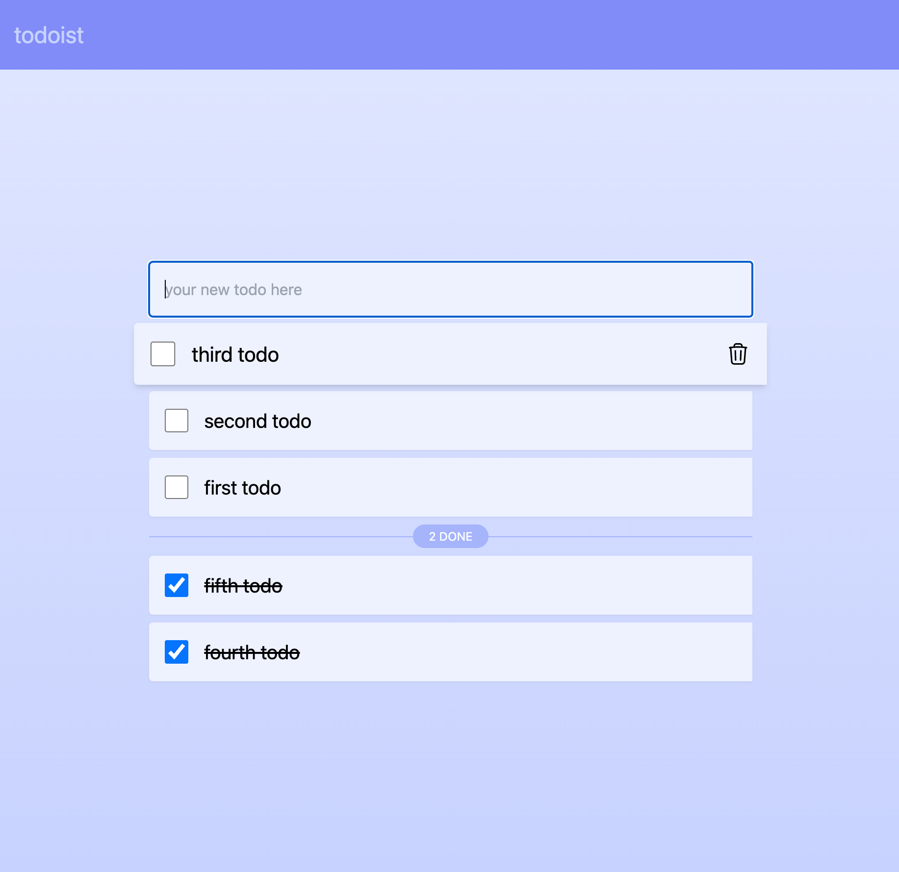

# gofiber-htmx-simple-todo

This is the result of playing around with Go, [Fiber](https://gofiber.io/), [TailwindCSS](https://tailwindcss.com/) and [HTMX](https://htmx.org/). Nothing fancy, just playing with tech.

## Getting started

```console
git clone git@github.com:Tmw/gofiber-htmx-simple-todo.git
cd gofiber-htmx-simple-todo
make run
```

## Screenshot



## License

[MIT](./LICENSE)
